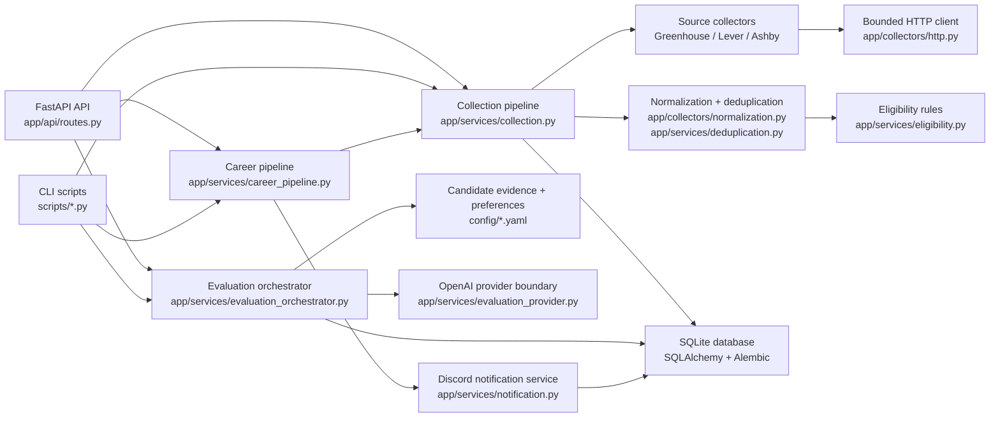

# CareerOS

CareerOS is a Python backend system that collects public job listings, normalizes them, evaluates fit against verified candidate evidence, and prepares notification-ready match summaries.

## Problem

Job search workflows often become a manual loop: checking multiple ATS boards, copying listings into spreadsheets, filtering stale or unsuitable roles, and deciding which opportunities deserve attention. CareerOS turns that workflow into a maintainable backend pipeline with clear data boundaries and safe optional integrations.

## What CareerOS Does

- Collects public Greenhouse, Lever, and Ashby listings from configured sources.
- Normalizes job data into typed schemas.
- Deduplicates jobs by source identity and cross-source fingerprints.
- Applies deterministic eligibility rules before any AI evaluation.
- Optionally evaluates jobs through a configured OpenAI provider boundary.
- Optionally sends deduplicated Discord notifications for qualifying matches.
- Persists jobs, runs, evaluations, and notification attempts in SQLite through async SQLAlchemy and Alembic migrations.

## See It in Action

1. Initialize the local SQLite database.
2. Start the FastAPI application.
3. Open `http://127.0.0.1:8000/docs`.
4. Trigger a safe dry-run evaluation with `POST /evaluations/run`.
5. Review persisted jobs, runs, evaluations, and notifications through the API.
6. Use `DEMO.md` and `examples/` for a local recording script and sanitized request/response examples.

CareerOS does not include a live deployment. External OpenAI and Discord calls are optional and must be configured through local environment variables.

## Implemented Features

- FastAPI API with typed request and response schemas.
- Async SQLAlchemy persistence with SQLite and Alembic migrations.
- Public ATS collectors for Greenhouse, Lever, and Ashby.
- Bounded async HTTP client behavior with timeouts, response-size limits, retry budgets, and disabled redirects.
- HTML cleanup, source normalization, deterministic deduplication, and eligibility filtering.
- OpenAI recruiter-evaluation boundary with structured outputs, prompt sanitization, caching, budgets, and fake-provider tests.
- Discord notification boundary with webhook validation, retry handling, deduplication, and fake-provider tests.
- CLI scripts for collection, evaluation, source validation, pipeline runs, DB initialization, and secret scanning.
- GitHub Actions CI for secret scanning, Ruff formatting, Ruff linting, strict Mypy, DB initialization, and Pytest.
- Optional local scheduling through Windows Task Scheduler scripts.

## Architecture



More detail is available in [docs/architecture.md](docs/architecture.md).

## Data Flow

1. `app/api/routes.py` or `scripts/*.py` receives a collection, evaluation, or full-pipeline request.
2. `app/services/collection.py` loads `config/source_config.yaml` and creates the configured collectors.
3. `app/collectors/*.py` call documented public ATS endpoints through `app/collectors/http.py`.
4. `app/collectors/normalization.py` cleans HTML and removes sensitive raw payload fields.
5. `app/services/deduplication.py` creates deterministic fingerprints for source and cross-source deduplication.
6. `app/services/eligibility.py` applies deterministic candidate preference rules before AI evaluation.
7. `app/db/models.py` stores companies, jobs, collector runs, evaluations, application-package metadata, and notifications.
8. `app/services/evaluation_input.py` builds sanitized prompts from normalized jobs and verified YAML evidence.
9. `app/services/evaluation_provider.py` isolates OpenAI calls behind an injectable provider protocol.
10. `app/services/evaluation_repository.py` caches successful evaluations and persists retryable failures.
11. `app/services/notification.py` formats qualifying evaluations and records Discord notification attempts.

## Quick Start

```powershell
py -3.12 -m venv .venv
Set-ExecutionPolicy -Scope Process -ExecutionPolicy Bypass -Force
.\.venv\Scripts\Activate.ps1
python -m pip install --upgrade pip
python -m pip install -e ".[dev]"
Copy-Item .env.example .env
python -m scripts.init_db
python -m uvicorn app.main:create_app --factory --reload
```

Open `http://127.0.0.1:8000/docs`.

Safe local commands:

```powershell
python -m scripts.evaluate_jobs --dry-run --limit 5
python -m scripts.scan_secrets
python -m pytest -q
```

## API Examples

See [docs/api.md](docs/api.md) for curl and PowerShell examples for the real routes in `app/api/routes.py`.

Minimal dry-run evaluation request:

```bash
curl -X POST http://127.0.0.1:8000/evaluations/run \
  -H "Content-Type: application/json" \
  -d "{\"dry_run\": true, \"limit\": 5}"
```

Example files:

- [examples/collection-request.json](examples/collection-request.json)
- [examples/collection-response.json](examples/collection-response.json)
- [examples/evaluation-request.json](examples/evaluation-request.json)
- [examples/evaluation-response.json](examples/evaluation-response.json)
- [examples/notification-preview.json](examples/notification-preview.json)
- [examples/sample-logs.txt](examples/sample-logs.txt)

## Docker

The Docker image runs the FastAPI application. It does not include credentials, a live database volume, or a hosted deployment.

```powershell
docker build -t careeros .
docker run --rm -p 8000:8000 --env-file .env careeros
```

For local development, the PowerShell quick start remains the simplest path because it initializes SQLite and installs development tools.

## Testing and Quality Checks

```powershell
python -m scripts.scan_secrets
python -m ruff format --check .
python -m ruff check .
python -m mypy app scripts tests
python -m scripts.init_db
python -m pytest -q
python -m pytest --cov=app --cov-report=term-missing
```

Dependency audit, when installed:

```powershell
python -m pip_audit . --skip-editable
```

## Security

- Runtime secrets belong only in an ignored local `.env` file or a secret manager.
- `OPENAI_API_KEY` and `DISCORD_WEBHOOK_URL` are optional and must not be committed.
- Tests use fake providers and block unmocked network calls.
- Logs and errors are sanitized through `app/core/security.py`.
- The repository includes `SECURITY.md` and a local secret-scan script.

## Operational Boundaries

- Collectors read documented public ATS endpoints only.
- CareerOS does not authenticate into ATS systems, submit applications, bypass CAPTCHA, or evade access controls.
- Collectors currently run sequentially at the pipeline level. This keeps local runs conservative and makes per-source failures easier to isolate.
- Bounded concurrency is applied inside supported HTTP operations through `ResilientHttpClient`.
- The broad collector exception boundary in `CollectionPipeline._run_collector` is intentional: one failed source records a failed `CollectorRun` and sanitized error without crashing the whole collection request.
- OpenAI and Discord integrations are isolated behind provider interfaces so tests can run without credentials.
- Windows Task Scheduler scripts are optional local automation helpers, not required infrastructure.

## Limitations

- SQLite is the supported local database.
- Evaluation concurrency is intentionally one request at a time.
- OpenAI and Discord integrations require user-provided credentials.
- Docker is available for the API process, but local DB initialization is still performed through project scripts.
- No frontend, hosted dashboard, or live deployment is included.
- Source registry quality depends on validated public ATS identifiers.

## Roadmap

Planned work is tracked in [ROADMAP.md](ROADMAP.md). Current roadmap areas include attributable company research, resume optimization, tailored application package generation, analytics, and frontend/dashboard work.

## Further Documentation

- [DEMO.md](DEMO.md) - local demo flow and Loom script
- [docs/api.md](docs/api.md) - API usage examples
- [docs/architecture.md](docs/architecture.md) - architecture notes
- [CONTRIBUTING.md](CONTRIBUTING.md) - development workflow
- [SECURITY.md](SECURITY.md) - vulnerability reporting and secret handling

CareerOS is available under the [MIT License](LICENSE).
